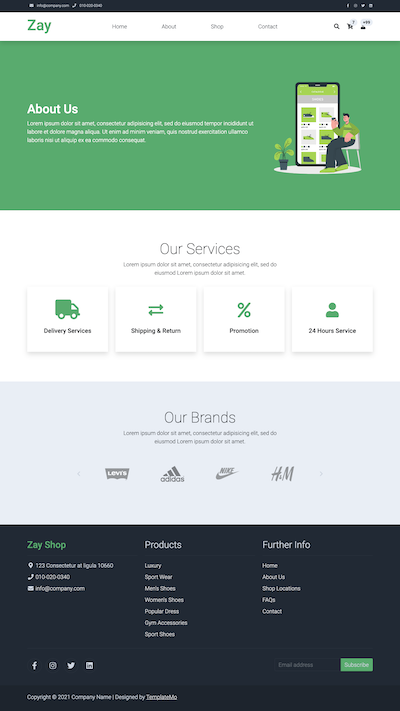
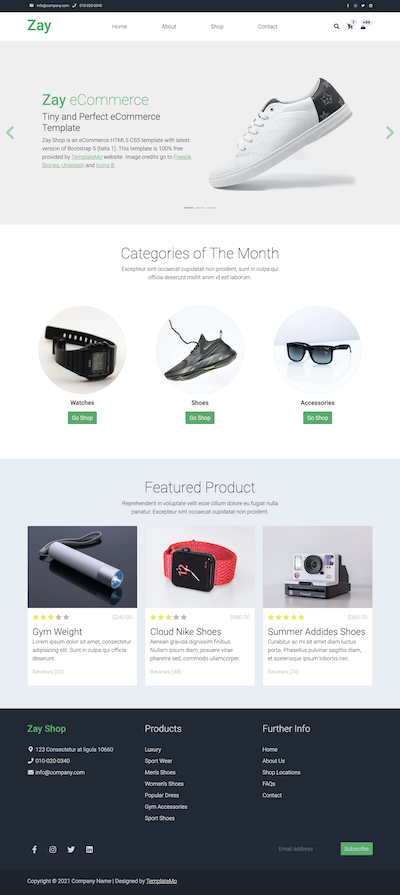
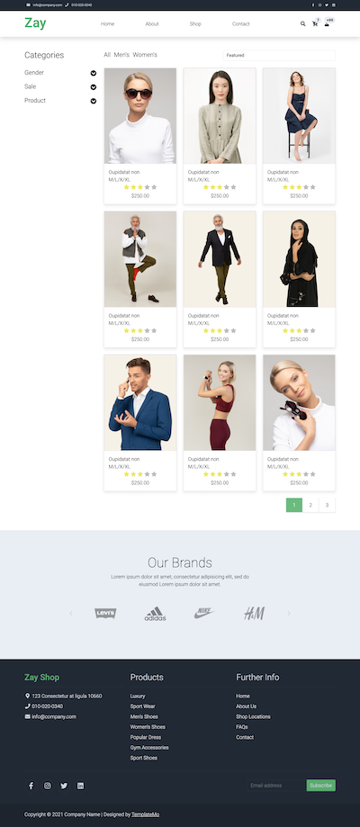
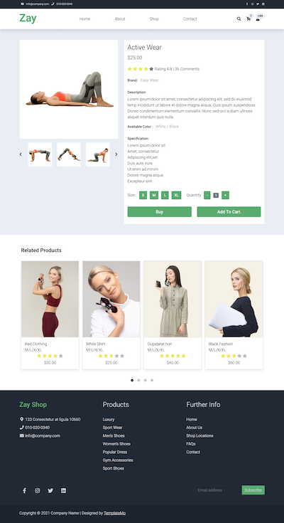
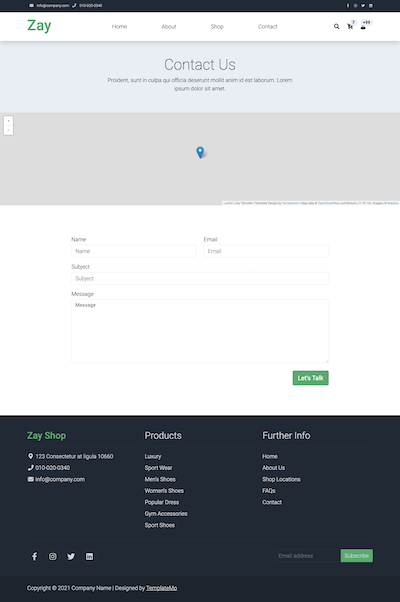

# OnlineShop Django Project

Welcome to the OnlineShop Django project! This README provides an overview of the project structure, its apps, and key functionalities.

## Project Overview

The OnlineShop project is a web application built with Django, focused on creating a fully-featured online store. It consists of several applications:

- **Users App**: This app customizes the Django User model by adding fields such as phone, address, postal code, gender, and an avatar. It includes forms for user registration and updating.

- **Products App**: This app manages product-related data with models like Category, Specification, Product, File, and Banner. Admins can add banners, manage products, and associate categories, files, and specifications with products.

- **Carts App**: The Carts app is responsible for creating user-specific carts, enabling users to select and manage products.

- **Contact Us App**: Users can send messages to site administrators via the Contact Us form.

## Key Features

### Users App

- **Custom User Model**: CustomUser extends the Django User model with additional fields.

- **Forms**: CustomUserCreationForm for user registration and CustomUserChangeForm for user updates.

- **Views**: Function-based views, secured with login_required decorators, including user_detail_view, user_update_view, and user_register_view.

### Products App

- **Models**: Category, Specification, Product, File, and Banner models are used to manage product-related information.

- **Views**: Function-based views, including data_list_view for the homepage, product_detail_view for individual product details, and category_list_view for displaying product categories.

### Carts App

- **Models**: Cart model for managing user-specific carts and products.

- **Views**: user_cart_list_view to display selected products in the user's cart, and create_cart_view for creating new carts.

### Contact Us App

- **Model**: ContactUs model for users to send messages to site administrators.

- **Form**: A form for user communication with site administrators.

- **View**: contact_us_view for handling user messages.

## Technologies Used

- **Django**: The project is built using the Django web framework, providing a robust structure for web application development.

- **PostgreSQL**: PostgreSQL is used as the project's database management system, ensuring efficient data storage.

- **HTML/CSS**: HTML and CSS templates are utilized to create the project's user interface.

- **Media Files**: Media files are stored in a designated media directory.

## Getting Started

1. **Installation**: Make sure you have Django and project dependencies installed. Consider using virtual environments to manage dependencies.

2. **Database Setup**: Configure PostgreSQL as your database. Update database settings in the project's settings.py file.

3. **Migrations**: Run database migrations to create tables for the models: `python manage.py makemigrations` and `python manage.py migrate`.

4. **Superuser**: Create an admin superuser with `python manage.py createsuperuser` to access the Django admin panel.

5. **Templates**: Customize HTML and CSS templates for the user interface.

6. **Run the Server**: Start the Django development server with `python manage.py runserver`.

7. **Access the Admin Panel**: Go to `/admin` in your browser to access the admin panel. Here, you can manage users, products, carts, and contact messages.

## Images



<hr>



<hr>



<hr>



<hr>



## Project Structure

```plaintext
OnlineShop/
|-- users/
|   |-- models.py
|   |-- forms.py
|   |-- views.py
|   |-- ...
|-- products/
|   |-- models.py
|   |-- views.py
|   |-- ...
|-- carts/
|   |-- models.py
|   |-- views.py
|   |-- ...
|-- contact_us/
|   |-- models.py
|   |-- forms.py
|   |-- views.py
|   |-- ...
|-- media/
|-- templates/
|-- ...
